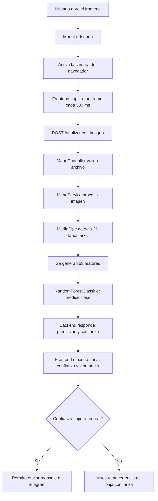
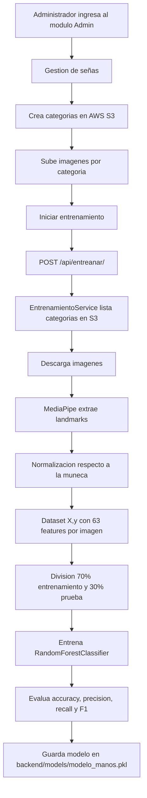
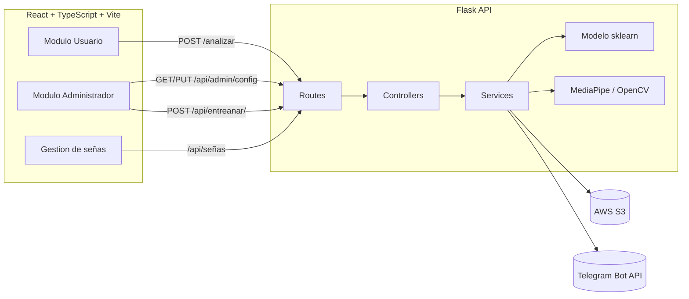

# Manual Tecnico - HandTalk AI

## 1. Descripcion general

HandTalk AI es una aplicacion web para reconocer señas de mano usando vision por computadora y aprendizaje automatico. El sistema permite:

- Capturar imagenes desde la camara del navegador.
- Detectar landmarks de la mano con MediaPipe.
- Convertir la mano detectada en un vector numerico de caracteristicas.
- Clasificar la seña con un modelo entrenado de scikit-learn.
- Administrar categorias e imagenes de entrenamiento almacenadas en AWS S3.
- Entrenar nuevamente el modelo desde el modulo administrador.
- Enviar predicciones a Telegram cuando la confianza supera el umbral configurado.

El proyecto esta dividido en dos aplicaciones principales:

- `backend`: API REST construida con Flask.
- `frontend`: cliente web construido con React, TypeScript y Vite.

## 2. Descripcion de la arquitectura del sistema (modulos, flujo general)

### 2.1 Modulos principales

| Modulo               | Ubicacion                          | Responsabilidad                                                                        |
| -------------------- | ---------------------------------- | -------------------------------------------------------------------------------------- |
| Aplicacion Flask     | `backend/app.py`                   | Crea la API, habilita CORS, registra rutas e inicializa servicios.                     |
| Rutas HTTP           | `backend/routes/`                  | Define endpoints para prediccion, administracion, entrenamiento, señas y rostros.      |
| Controladores        | `backend/controllers/`             | Valida entradas HTTP y delega la logica a los servicios.                               |
| Servicios de negocio | `backend/services/`                | Contiene la logica de deteccion, entrenamiento, S3, configuracion y Telegram.          |
| Vision HandTalk      | `backend/handtalk/`                | Contiene utilidades de inferencia, camara, deteccion de mano y extraccion de features. |
| Modelo entrenado     | `backend/models/modelo_manos.pkl`  | Archivo serializado con joblib. Guarda el clasificador y metadata.                     |
| Configuracion admin  | `backend/config/admin_config.json` | Guarda umbral de confianza, formato de mensaje y historial.                            |
| Cliente web          | `frontend/src/`                    | Interfaz de usuario y administrador. Consume la API del backend.                       |

### 2.2 Flujo general de uso



### 2.3 Flujo de entrenamiento



### 2.4 Diagrama de componentes



### 2.5 Infraestructura en AWS

El sistema utiliza servicios de AWS para el despliegue y almacenamiento:

- **Amazon S3**: almacena el frontend compilado y tambien el dataset de imagenes para entrenamiento.
- **Amazon EC2**: ejecuta la maquina virtual donde se despliega el backend.

#### Bucket S3 del frontend

El frontend se publica en un bucket de Amazon S3. En la captura se observa el bucket con archivos como `index.html`, `favicon.svg`, `icons.svg` y la carpeta `assets/`, que corresponden a la aplicacion web compilada.


#### Instancia EC2 del backend

El backend se ejecuta en una instancia EC2. Esta maquina virtual permite mantener activa la API que recibe las peticiones del frontend, procesa imagenes y se comunica con los servicios necesarios.


## 3. Explicacion del modelo de Machine Learning (algoritmo, features, clases)

### 3.1 Algoritmo utilizado

El modelo de clasificacion de señas usa:

- Algoritmo: `RandomForestClassifier`.
- Libreria: `scikit-learn`.
- Configuracion en `backend/services/entrenamiento_services.py`:
  - `n_estimators=300`
  - `max_depth=None`
  - `random_state=42`
  - `n_jobs=-1`
  - `class_weight="balanced"`

Random Forest combina varios arboles de decision para producir una prediccion final. Es adecuado para este proyecto porque trabaja bien con features numericas, permite multiples clases y puede entrenarse sin requerir una red neuronal propia.

### 3.2 Features utilizadas

Cada imagen se procesa con MediaPipe para detectar una mano. MediaPipe devuelve 21 puntos o landmarks. De cada landmark se toman 3 coordenadas:

- `x`
- `y`
- `z`

Por lo tanto, el vector de entrada tiene:

```text
21 landmarks * 3 coordenadas = 63 features
```

Durante el entrenamiento principal, el servicio `EntrenaciontoService.normalizar_landmarks` normaliza los puntos tomando como referencia la muneca, que es el landmark `0`. Para cada punto se calcula:

```text
x_normalizado = x - x_muneca
y_normalizado = y - y_muneca
z_normalizado = z - z_muneca
```

Esto ayuda a que el modelo aprenda la forma de la mano y no dependa tanto de la posicion exacta dentro de la imagen.

Nota tecnica: tambien existe el modulo `backend/handtalk/cv/features.py`, que ademas de centrar en la muneca escala los puntos usando la distancia muneca-MCP del dedo medio. El flujo actual del frontend usa `POST /analizar`, que trabaja con `ManoService` y coincide con la normalizacion usada en entrenamiento.

### 3.3 Clases del modelo

Las clases son las categorias de señas guardadas en AWS S3 bajo el prefijo configurado. El entrenamiento toma cada carpeta como una clase.

El modelo guarda las clases en la metadata del archivo:

```text
backend/models/modelo_manos.pkl
metadata.etiquetas
```

El frontend consulta las clases con:

```text
GET /api/admin/modelo/clases
```

Pendiente de completar: no hay dataset local dentro del repositorio, por lo que las clases exactas deben confirmarse desde S3 o ejecutando el endpoint anterior con el backend levantado. En `admin_config.json` aparecen ejemplos historicos como `hola`, `5`, `Dibujo`, `Musica`, `Adios`, `Entendido` y `Gracias`, pero esos datos pertenecen al historial/configuracion y no garantizan que sean todas las clases del modelo actual.

## 4. Proceso de entrenamiento (dataset, como se entreno, scripts utilizados)

### 4.1 Dataset

El dataset no esta guardado localmente en el repositorio. El proyecto usa AWS S3.

Configuracion por defecto en `backend/services/s3_service.py`:

| Variable         | Valor por defecto            | Descripcion                      |
| ---------------- | ---------------------------- | -------------------------------- |
| `S3_BUCKET_NAME` | `img-entramiento-ia1-grupo5` | Bucket donde estan las imagenes. |
| `S3_DATA_PREFIX` | `Data/`                      | Carpeta base del dataset.        |
| `AWS_REGION`     | `us-east-2`                  | Region AWS.                      |

En la siguiente captura se observa el bucket usado para el dataset de entrenamiento. Dentro de la carpeta `Data/` hay subcarpetas por clase, por ejemplo `Adios`, `Bien`, `Como Estas`, `Dibujo`, `Entendido`, `Gracias`, `Hola`, `Mal` y `Musica`.


La estructura esperada es:

```text
Data/
  Hola/
    imagen1.jpg
    imagen2.jpg
  Gracias/
    imagen1.jpg
    imagen2.jpg
  Adios/
    imagen1.jpg
```

Cada subcarpeta representa una clase.

### 4.2 Script o servicio utilizado

El entrenamiento se realiza desde:

```text
backend/services/entrenamiento_services.py
```

Tambien se puede iniciar desde el frontend en el Modulo Administrador, boton `Iniciar entrenamiento`, que consume:

```text
POST /api/entreanar/
```

Nota: la ruta tiene el nombre `entreanar` en el codigo actual.

### 4.3 Pasos del entrenamiento

1. Se listan las categorias disponibles en S3.
2. Se descargan las imagenes de cada categoria.
3. Cada imagen se decodifica con OpenCV.
4. La imagen se convierte de BGR a RGB.
5. MediaPipe detecta landmarks de una mano.
6. Se normalizan los 21 landmarks usando la muneca como punto base.
7. Se genera un vector de 63 features.
8. Se divide el dataset en 70% entrenamiento y 30% prueba.
9. Se entrena `RandomForestClassifier`.
10. Se evalua el modelo con `accuracy_score` y `classification_report`.
11. Se guarda el paquete del modelo con `joblib.dump`.

### 4.4 Salida del entrenamiento

El entrenamiento genera:

```text
backend/models/modelo_manos.pkl
```

El archivo guarda:

- `modelo`: clasificador entrenado.
- `metadata`: etiquetas, total de muestras, muestras de entrenamiento, muestras de prueba, conteo por clase, normalizacion, numero de features y algoritmo.

## 5. Tecnologias utilizadas (OpenCV, MediaPipe, scikit-learn, etc.)

| Tecnologia       | Uso                                                        |
| ---------------- | ---------------------------------------------------------- |
| Python           | Lenguaje principal del backend.                            |
| Flask            | API REST.                                                  |
| Flask-CORS       | Permite llamadas desde el frontend.                        |
| OpenCV           | Decodificacion de imagenes, webcam y procesamiento visual. |
| MediaPipe        | Deteccion de landmarks de mano.                            |
| NumPy            | Manejo de arreglos numericos.                              |
| scikit-learn     | Entrenamiento y prediccion del modelo.                     |
| joblib           | Carga y guardado del modelo `.pkl`.                        |
| boto3            | Conexion con AWS S3.                                       |
| requests         | Envio de mensajes a Telegram.                              |
| React            | Interfaz web.                                              |
| TypeScript       | Tipado del frontend.                                       |
| Vite             | Servidor de desarrollo y build del frontend.               |
| AWS S3           | Almacenamiento del dataset.                                |
| Telegram Bot API | Envio de mensajes con predicciones.                        |

## 6. Instrucciones de instalacion y ejecucion (entorno, dependencias)

### 6.1 Requisitos previos

- Python 3.11 o compatible.
- Node.js y npm.
- Webcam para usar el modulo de usuario.
- Credenciales de AWS si se usara gestion de dataset o entrenamiento.
- Token y chat id de Telegram si se usara el envio de mensajes.

### 6.2 Variables de entorno

Crear un archivo `.env` en `backend/` con las variables necesarias:

```env
AWS_ACCESS_KEY_ID=valor
AWS_SECRET_ACCESS_KEY=valor
AWS_REGION=us-east-2
S3_BUCKET_NAME=img-entramiento-ia1-grupo5
S3_DATA_PREFIX=Data/
TELEGRAM_BOT_TOKEN=valor
TELEGRAM_CHAT_ID=valor
```

Las variables de Telegram son opcionales si no se enviaran mensajes.

### 6.3 Instalar backend

```powershell
cd backend
python -m venv venv
.\venv\Scripts\Activate.ps1
pip install -r requirements.txt
```

En Linux o macOS:

```bash
cd backend
python3 -m venv venv
source venv/bin/activate
pip install -r requirements.txt
```

### 6.4 Ejecutar backend

Segun el codigo actual de `backend/app.py`, el servidor se levanta en el puerto `8000`:

```bash
cd backend
python app.py
```

URL base:

```text
http://127.0.0.1:8000
```

### 6.5 Instalar frontend

```bash
cd frontend
npm install
```

### 6.6 Ejecutar frontend

```bash
cd frontend
npm run dev
```

Vite mostrara una URL local, normalmente:

```text
http://127.0.0.1:5173
```

El frontend apunta a:

```text
http://localhost:8000
```

Esto esta configurado en:

```text
frontend/src/api/client.ts
```

## 7. Endpoints principales

| Metodo   | Ruta                                        | Descripcion                                       |
| -------- | ------------------------------------------- | ------------------------------------------------- |
| `GET`    | `/`                                         | Verifica que la API esta activa.                  |
| `POST`   | `/analizar`                                 | Recibe una imagen y predice la seña de mano.      |
| `GET`    | `/predict`                                  | Flujo alterno: captura desde webcam del servidor. |
| `GET`    | `/api/admin/config`                         | Obtiene configuracion administrativa.             |
| `PUT`    | `/api/admin/config`                         | Actualiza umbral, Telegram y formato de mensaje.  |
| `GET`    | `/api/admin/modelo/clases`                  | Lista clases del modelo entrenado.                |
| `GET`    | `/api/admin/history`                        | Obtiene historial de mensajes.                    |
| `POST`   | `/api/admin/telegram/test`                  | Envia prediccion a Telegram.                      |
| `POST`   | `/api/entreanar/`                           | Inicia entrenamiento del modelo.                  |
| `GET`    | `/api/señas/`                               | Lista categorias en S3.                           |
| `POST`   | `/api/señas/`                               | Crea una categoria.                               |
| `DELETE` | `/api/señas/{nombre}`                       | Elimina una categoria.                            |
| `GET`    | `/api/señas/{categoria}/imagenes`           | Lista imagenes de una categoria.                  |
| `POST`   | `/api/señas/{categoria}/imagenes`           | Sube una imagen.                                  |
| `DELETE` | `/api/señas/{categoria}/imagenes/{archivo}` | Elimina una imagen.                               |

## 8. Entrenamiento del modelo

### 1. Descripción General

El modelo tiene como objetivo clasificar señas de mano a partir de imágenes. Para ello, se utiliza MediaPipe para la extracción de características (landmarks) y un modelo de Machine Learning (Random Forest) para la clasificación.

El entrenamiento se realiza a partir de imágenes almacenadas en un bucket de Amazon S3.

---

### 2. Fuente de Datos

- Las imágenes se obtienen dinámicamente desde un bucket de S3.
- Cada carpeta dentro del bucket representa una categoría o etiqueta.

```python
s3 = S3Service()
categorias = s3.listar_categorias()

for etiqueta in categorias:
    imagenes = s3.listar_imagenes(etiqueta)
```

---

### 3. Extracción de Características

#### 3.1 Detección de Mano

```python
mp_image = mp.Image(
    image_format=mp.ImageFormat.SRGB,
    data=imagen_rgb
)

resultado = self.detector.detect(mp_image)
```

#### 3.2 Generación de Features

```python
if resultado.hand_landmarks:
    mano = resultado.hand_landmarks[0]
    puntos = self.normalizar_landmarks(mano)
```

#### 3.3 Normalización

```python
def normalizar_landmarks(self, mano):
    base_x = mano[0].x
    base_y = mano[0].y
    base_z = mano[0].z

    puntos = []

    for p in mano:
        puntos.extend([
            p.x - base_x,
            p.y - base_y,
            p.z - base_z
        ])

    return puntos
```

---

### 4. Construcción del Dataset

```python
X = []
y = []

X.append(puntos)
y.append(etiqueta)
```

Validaciones:

```python
if imagen is None:
    continue

if not resultado.hand_landmarks:
    continue

if len(puntos) != 63:
    continue
```

---

### 5. División de Datos

```python
X_train, X_test, y_train, y_test = train_test_split(
    X,
    y,
    test_size=0.3,
    random_state=42,
    stratify=y if usar_stratify else None
)
```

---

### 6. Modelo Utilizado

```python
self.modelo = RandomForestClassifier(
    n_estimators=300,
    max_depth=None,
    random_state=42,
    n_jobs=-1,
    class_weight="balanced"
)
```

---

### 7. Entrenamiento

```python
self.modelo.fit(X_train, y_train)
```

---

### 8. Evaluación

```python
predicciones = self.modelo.predict(X_test)
accuracy = accuracy_score(y_test, predicciones)
```

```python
reporte = classification_report(
    y_test,
    predicciones,
    output_dict=True,
    zero_division=0
)
```

---

### 9. Guardado del Modelo

```python
paquete_modelo = {
    "modelo": self.modelo,
    "metadata": metadata
}

joblib.dump(paquete_modelo, self.modelo_path)
```

---

### 10. Flujo General

```python
for etiqueta in categorias:
    for imagen in imagenes:
        detectar_mano()
        extraer_landmarks()
        normalizar()
        guardar_en_dataset()

dividir_datos()
entrenar_modelo()
evaluar_modelo()
guardar_modelo()
```
