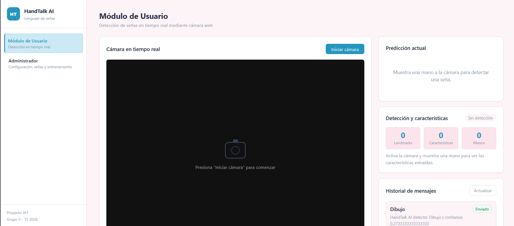
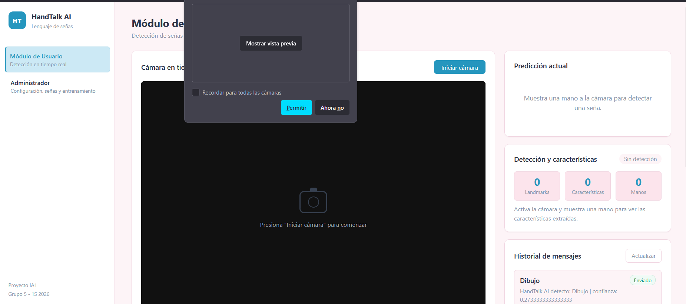
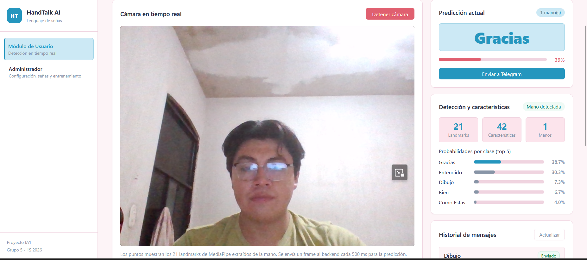
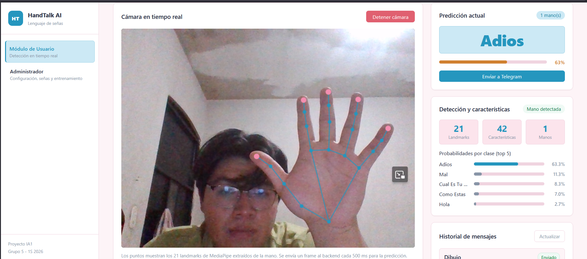
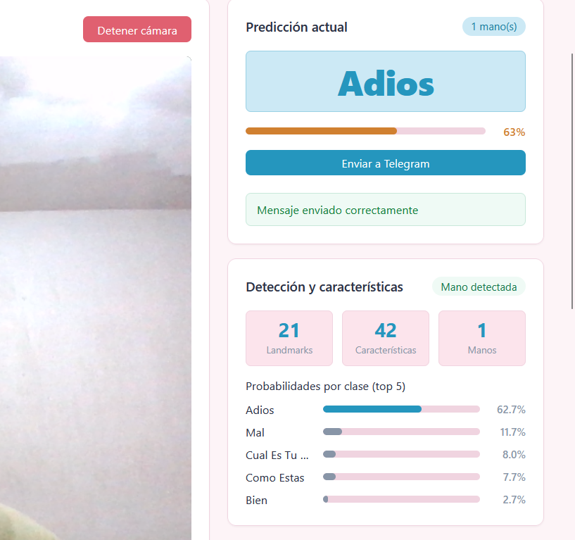
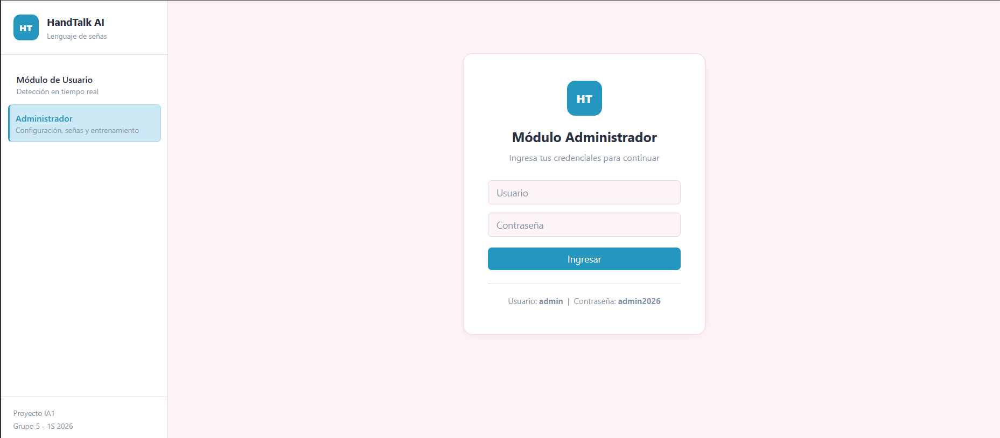
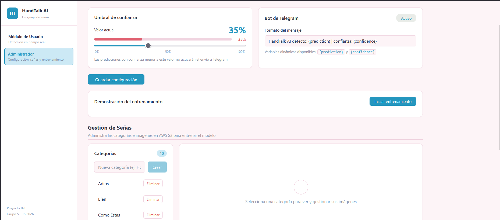
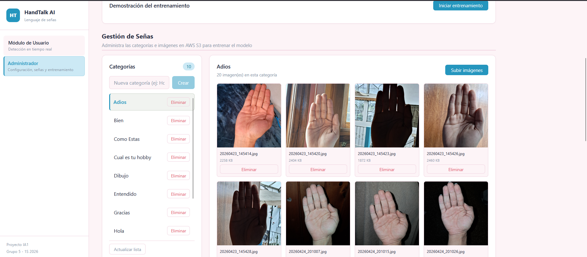

# Manual de Usuario - HandTalk AI

## 1. Que es HandTalk AI

HandTalk AI es una aplicacion que reconoce señas de mano usando la camara. La persona usuaria puede mostrar una seña frente a la camara y el sistema muestra la prediccion junto con un porcentaje de confianza.

## 2. Requisitos antes de usar

Antes de abrir la aplicacion, debe estar funcionando:

- El backend en EC2 de AWS.
- El frontend en la URL que prorciona el S3 de AWS `http://web-ia1-proyecto2-g5.s3-website.us-east-2.amazonaws.com/`.
- Una camara disponible en el navegador.
- Permiso del navegador para usar la camara.
- Un modelo entrenado en `backend/models/modelo_manos.pkl`.


## 2. Explicacion de como usar el aplicativo

Esta seccion explica como usar cada parte de la aplicacion de forma sencilla.

### 2.1 Uso del modulo de usuario

#### 2.1.1 Reconocer una seña




1. En el menu lateral, seleccionar `Modulo Usuario`.
2. Presionar el boton `Iniciar camara`.
3. Aceptar el permiso de camara en el navegador.

4. Colocar la mano frente a la camara.
5. Hacer una de las señas disponibles.
6. Esperar a que el sistema muestre la prediccion.

La pantalla mostrara:

- La camara en tiempo real.
- Puntos sobre la mano detectada.
- La prediccion actual.
- El nivel de confianza.
- Las señas disponibles del modelo.
- El historial de mensajes enviados.

#### 2.1.2 Interpretar la prediccion

Cuando el sistema reconoce una seña, aparece:

- Nombre de la seña detectada.
- Barra o porcentaje de confianza.
- Top de probabilidades por clase, cuando esta disponible.

Si la confianza es menor al umbral configurado por el administrador, el sistema muestra una advertencia y no permite enviar la prediccion a Telegram.

#### 2.1.3 Enviar una prediccion a Telegram


1. Realizar una seña frente a la camara.
2. Verificar que la prediccion sea correcta.
3. Confirmar que la confianza supere el umbral.
4. Presionar `Enviar a Telegram`.
5. Revisar el mensaje de estado.

Si Telegram esta desactivado desde administracion, el boton no estara disponible.

#### 2.1.4 Detener la camara


1. Presionar `Detener camara`.
2. El sistema apagara la camara y limpiara la prediccion actual.

## 3. Uso paso a paso del modulo administrador

### 3.1 Ingresar como administrador



1. En el menu lateral, seleccionar `Modulo Administrador`.
2. Ingresar las credenciales:

```text
Usuario: admin
Contraseña: admin2026
```

3. Presionar `Ingresar`.

### 3.2 Cambiar el umbral de confianza




1. Buscar la seccion `Umbral de confianza`.
2. Mover el control hasta el porcentaje deseado.
3. Presionar `Guardar configuracion`.

Este valor define desde que nivel de confianza una prediccion puede enviarse a Telegram.

### 3.3 Configurar Telegram


1. Buscar la seccion `Bot de Telegram`.
2. Activar o desactivar el envio con el boton de estado.
3. Editar el formato del mensaje si es necesario.
4. Usar las variables:

```text
{prediction}
{confidence}
```

5. Presionar `Guardar configuracion`.

Ejemplo de formato:

```text
HandTalk AI detecto: {prediction} | confianza: {confidence}
```

### 3.4 Gestionar Señas


En la seccion `Gestion de Señas` se pueden administrar las categorias e imagenes usadas para entrenar el modelo.

Para crear una categoria:

1. Escribir el nombre de la nueva seña.
2. Presionar `Crear`.

Para subir imagenes:


1. Seleccionar una categoria.
2. Presionar `Subir imagenes`.
3. Elegir archivos `.jpg`, `.jpeg`, `.png`, `.heic` o `.heif`.
4. Esperar el mensaje de confirmacion.

Para eliminar una imagen:

1. Seleccionar la categoria.
2. Buscar la imagen.
3. Presionar `Eliminar`.

Para eliminar una categoria:

1. Buscar la categoria en la lista.
2. Presionar `Eliminar`.
3. Confirmar la accion.

Importante: al eliminar una categoria se eliminan tambien sus imagenes.

### 3.5 Entrenar el modelo

1. Ingresar al `Modulo Administrador`.
2. Verificar que existan categorias con imagenes.
3. Ir a `Demostracion del entrenamiento`.
4. Presionar `Iniciar entrenamiento`.
5. Esperar a que termine el proceso.


## 4. Consejos para mejores resultados

- Usar buena iluminacion.
- Mostrar la mano completa.
- Evitar fondos muy cargados.
- Mantener la mano dentro del cuadro de la camara.
- Subir varias imagenes por cada seña.
- Usar imagenes variadas: diferentes personas, posiciones y fondos.
- No entrenar con categorias que tengan muy pocas imagenes.
